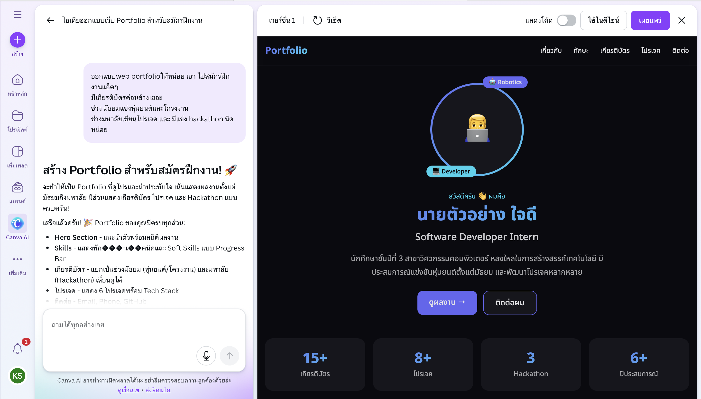
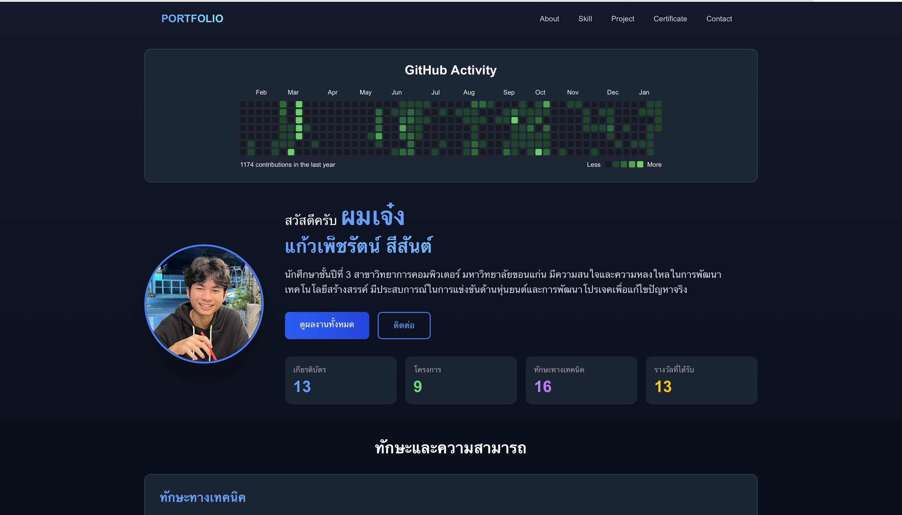
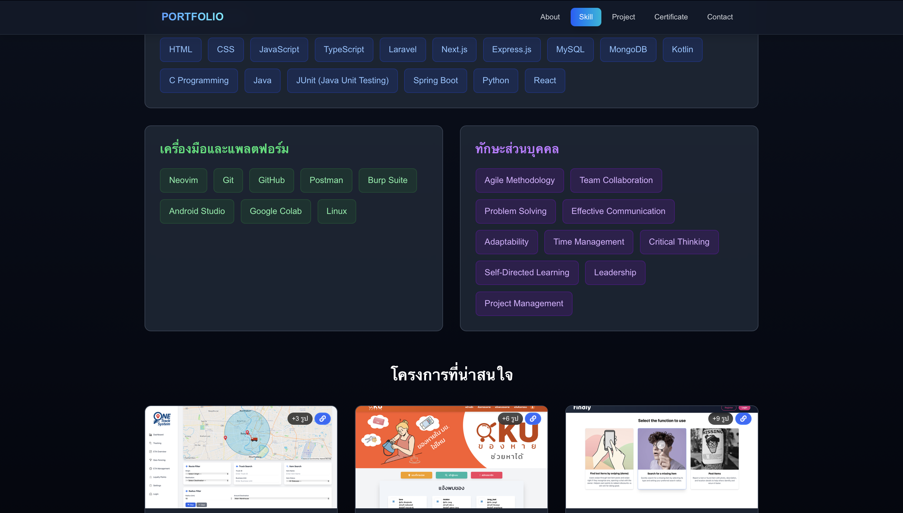
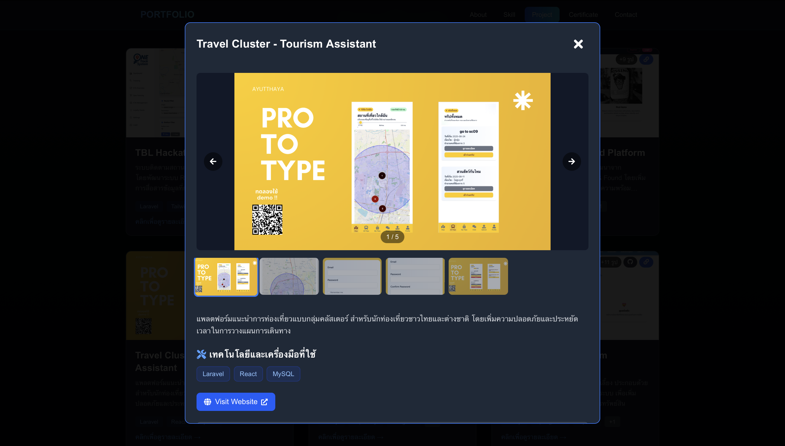
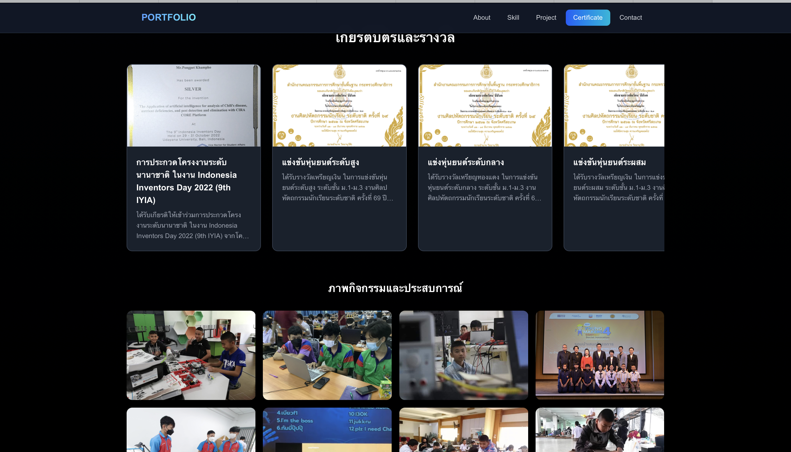

## Design Process

Since I’m not good at design, I use **Canva AI** to help generate the initial UI structure.

### 1. Canva AI Prompt
I start by writing a prompt for Canva AI to generate the initial layout and design direction.

### 2. Build the Prototype
Based on the structure and layout suggested by Canva AI, I manually build and refine the prototype.

### 3. Decorate and Add Details
Finally, I decorate the prototype and add more details to improve the visual quality and user experience.

